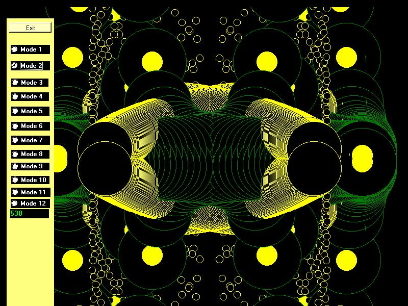



## graphical show

### Description

this code make a graphic animation with cos,sin and tan combined to circle method.cool effects resulting from that,if you like graphics,you may like this...the screenshot doesn't show all animation ,they are 12 different animations.have a nice day all friends on PSC.
 
### More Info
 

             |
---                |---
**Submitted On**   |2007-06-12 21:06:10
**By**             |[El Bakkali Mounib](https://github.com/Planet-Source-Code/PSCIndex/blob/master/ByAuthor/el-bakkali-mounib.md)
**Level**          |Beginner
**User Rating**    |5.0 (10 globes from 2 users)
**Compatibility**  |VB 4\.0 \(16\-bit\), VB 4\.0 \(32\-bit\), VB 5\.0, VB 6\.0
**Category**       |[Graphics](https://github.com/Planet-Source-Code/PSCIndex/blob/master/ByCategory/graphics__1-46.md)
**World**          |[Visual Basic](https://github.com/Planet-Source-Code/PSCIndex/blob/master/ByWorld/visual-basic.md)
**Archive File**   |[graphical\_2072586262007\.zip](https://github.com/Planet-Source-Code/el-bakkali-mounib-graphical-show__1-68891/archive/master.zip)

